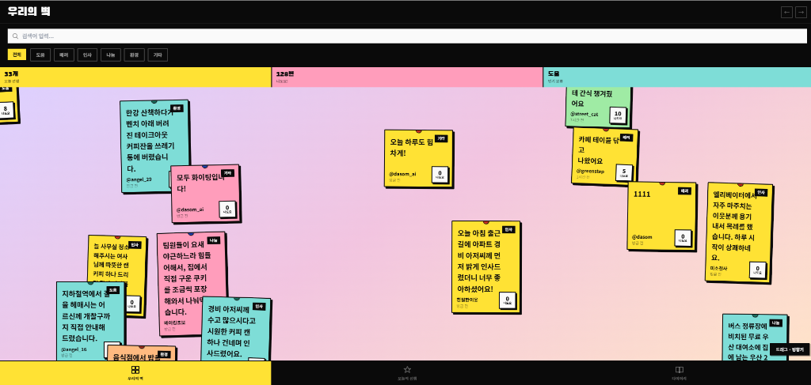

<div align="center">
  
  
  <h1>🧱 다솜마을 우리의 벽 (Warmth Wall)</h1>
  <p><strong>우리의 작은 선행이 모여 만드는 따뜻한 마을 커뮤니티</strong></p>
  
  
  
  
  
  
</div>

<br />

## 📖 프로젝트 소개

'우리의 벽(Warmth Wall)'은 다솜마을 주민들이 서로의 선행을 공유하고 격려하며, 마을 전체의 따뜻함을 시각적으로 체감할 수 있는 **온라인 커뮤니티 플랫폼**입니다. 

자신이 실천한 작은 친절을 '포스트잇' 형태로 기록하고, 다른 이웃들의 선행에 **'나도요(공감)'** 버튼을 누르며 선한 영향력을 퍼뜨릴 수 있습니다. 구글의 **Gemini AI**를 활용하여 매주 가장 부족한 선행 카테고리를 자동 분석하고 이벤트로 선정하는 스마트 캠페인 시스템을 제공합니다.

---

## ✨ 핵심 기능 (Key Features)

### 1. 💛 무한 캔버스 '우리의 벽' & 스마트 필터링
- **무한 줌인/줌아웃 벽 (Public Wall):** 마을 전체의 포스트잇이 칠판에 붙은 것처럼 시각적으로 아름답게 렌더링됩니다. 마우스 휠과 드래그를 통해 자유롭게 캔버스를 탐험할 수 있습니다.
- **오늘의 선행 (Private Filter):** 수많은 데이터 중에서도 '오늘', '내가 작성한' 글만 즉각적으로 필터링하여 빠릿하게 보여줍니다. (새로고침 없는 SPA 아키텍처)

### 2. 👍 나도요 (공감하기) & 낙관적 UI (Optimistic UI)
- 타인의 선행에 동참하고 싶을 때 누르는 **'나도요'** 뱃지 기능이 구현되어 있습니다.
- **UX 극대화:** 버튼 클릭 시 서버의 응답을 기다리지 않고 즉각적으로 화면의 숫자를 올리는 **Optimistic UI(낙관적 업데이트)** 기법이 적용되어 있어 매우 부드러운 반응성을 자랑합니다.

### 3. 🤖 AI 이벤트 자동 선정 (Powered by Gemini)
- **Gemini AI**가 매주 선행 데이터를 분석하여 가장 부족한 카테고리를 자동으로 찾아냅니다.
- 해당 카테고리를 이번 주 이벤트 미션으로 자동 선정하여, 주민들이 골고루 다양한 선행을 실천하도록 유도합니다.

### 4. 🍇 선행 포도밭 (Contribution Graph) & 완벽한 DB 연동
- 내 선행 지수(포인트)와 과거 활동을 깃허브 잔디처럼 한눈에 볼 수 있는 **'선행 포도밭'**을 제공합니다.
- **게시글 삭제 기능:** 내가 쓴 글을 삭제하면 DB에서 깔끔하게 지워지고, 어뷰징 방지를 위해 획득했던 점수도 즉시 삭감됩니다.

### 5. 🌙 관리자 시뮬레이션 (자정 강제 초기화)
- 해커톤 시연을 위해 프론트엔드 상태를 강제로 다음날(8월 8일)로 전환하여, 하루가 지나 벽이 텅 비워지는 연출을 완벽하게 시뮬레이션할 수 있는 기능을 내장했습니다.

---

## 🏗️ 기술 스택 및 아키텍처

- **Frontend:** Next.js (App Router), React Hooks, Tailwind CSS
- **Backend:** Next.js API Routes (Serverless)
- **Database:** SQLite3 (`better-sqlite3`)
- **AI 연동:** Google Generative AI (Gemini) — 이벤트 카테고리 자동 선정

### 📌 데이터 플로우 구조
단일 파일(`src/app/page.tsx`) 내에서 복잡한 상태 관리와 인터랙티브 화면 렌더링을 쾌적하게 처리하는 고도화된 SPA 구조를 가집니다. 경량 데이터베이스(`data/warmth_wall.db`)와 직접 통신하는 백엔드 API가 연결되어 있어 별도의 복잡한 서버 인프라 없이도 즉각적인 실행이 가능합니다.

---

## 🚀 실행 방법 (Getting Started)

1. **저장소 클론 및 패키지 설치**
   ```bash
   git clone https://github.com/kimchi00100/Dasom_Warmth_Wall.git
   cd Dasom_Warmth_Wall
   npm install
   ```

2. **환경변수 설정 (API Key 세팅)**
   프로젝트 루트 디렉토리에 `.env.local` 파일을 생성하고, 발급받은 구글 Gemini API 키를 입력합니다.
   ```env
   GEMINI_API_KEY=당신의_실제_API_키를_넣으세요
   ```

3. **개발 서버 실행**
   ```bash
   npm run dev
   ```

4. **웹 브라우저 접속**
   `http://localhost:3000` 으로 접속하여 다솜마을의 따뜻함을 직접 경험해 보세요!

---
<div align="center">
  <i>💡 2026 다솜마을 해커톤 출품작 💡</i>
</div>
